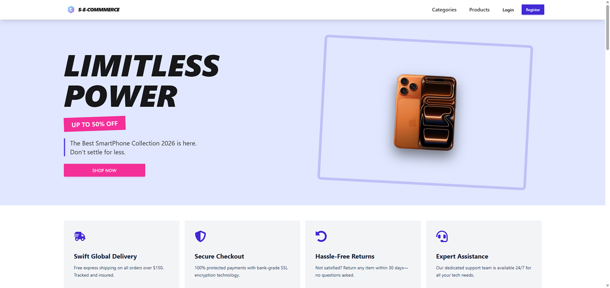
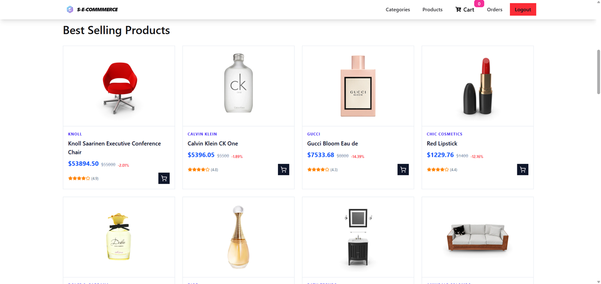
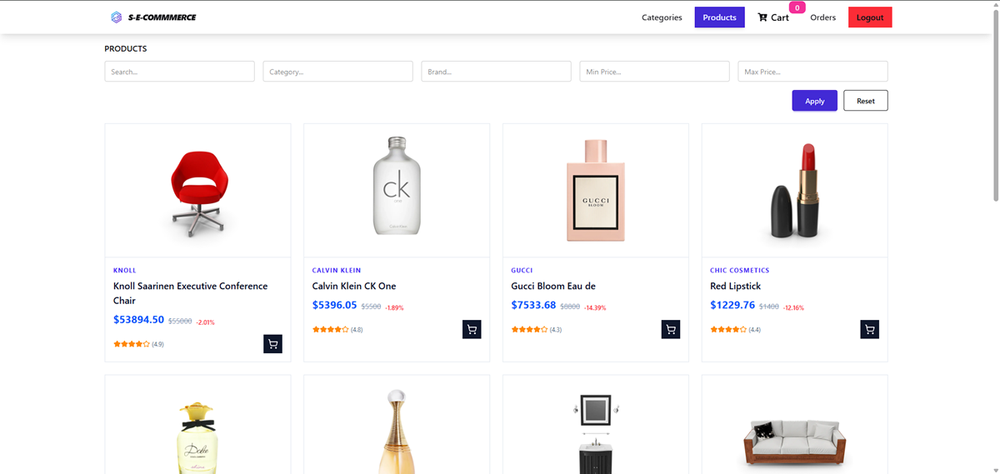
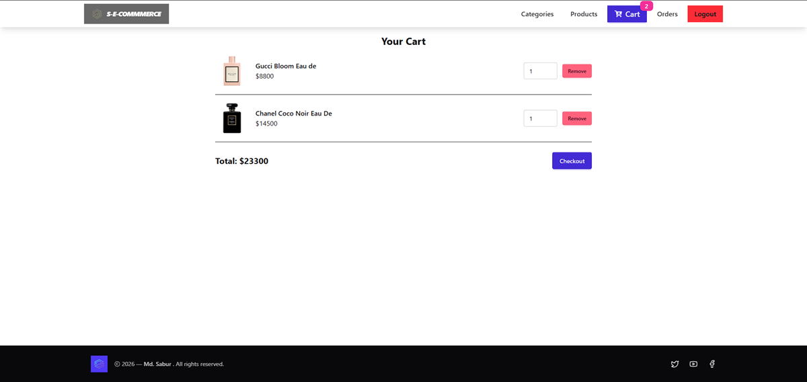
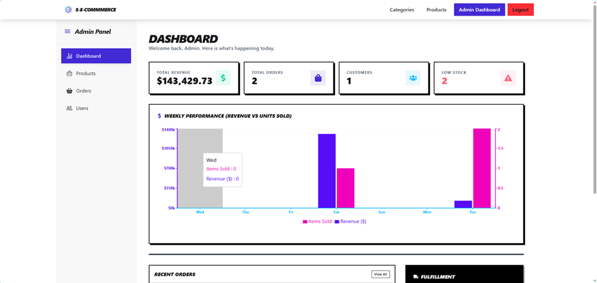

# 🛒 Full-Stack E-Commerce Application (Live)

This is a **full-stack E-Commerce web application** built as a **portfolio project** to demonstrate real-world product development using modern frontend and backend technologies.

The project covers the **complete e-commerce lifecycle**, including:

-   User authentication & authorization
-   Product & category management
-   Cart and checkout flow
-   Order creation & tracking
-   Admin dashboard for managing products, users, and orders

The goal of this project is to reflect **production-level structure, clean architecture, and scalable design**, while keeping the codebase understandable and maintainable.

---

## Live LInks

[](https://sabur-e-commerce-p-project-one-live.vercel.app/)
🚀 Deployed on Vercel
👉 https://sabur-e-commerce-p-project-one-live.vercel.app/

---

## 📸 Screenshots

> Screenshots are taken from the live deployment.

### 🏠 Home Page

### 1



### 2



### 📦 Product Listing

### 1



### 2

### 🛒 Cart & Checkout



### 🛠️ Admin Dashboard



---

## 🧱 Tech Stack

### Frontend

-   **React (Vite)**
-   React Router
-   Zustand (state management)
-   Axios
-   Modular component architecture
-   Responsive UI design

### Backend

-   **Node.js**
-   **Express.js**
-   MongoDB with Mongoose
-   JWT Authentication
-   Middleware-based authorization
-   REST API architecture

### Deployment

-   **Frontend:** Vercel
-   **Backend:** Node / Vercel-ready API
-   **Database:** MongoDB Atlas

---

## 🎯 Why This Project Matters

This project was intentionally designed to simulate a **real commercial e-commerce system**, focusing on:

-   Separation of frontend & backend responsibilities
-   RESTful API design
-   Role-based access control (Admin vs User)
-   Frontend state management at scale
-   Clean routing and modular architecture
-   Deployment-ready configuration

---

## 🗂️ Project Structure

```
E-commerce-P-Project-one-Live
├── backend   # REST API, Auth, Database logic
├── client    # React frontend (Vite)
└── README.md # Project Overview
```

Each folder contains its **own detailed README** explaining implementation details.

---

## 🧩 Core Features

### 👤 Authentication & Security

-   User registration & login
-   JWT-based authentication
-   Protected routes (frontend & backend)
-   Role-based access (Admin / User)

### 🛍️ Shopping Experience

-   Product listing & details
-   Category-based browsing
-   Add to cart functionality
-   Checkout & order placement
-   Order history & order details

### 🛠️ Admin Panel

-   Admin analytics enhancements
-   Create, update, and delete products
-   View and manage orders
-   Update order status
-   View registered users
-   Platform statistics dashboard

---

## 🚀 Getting Started (Local Setup)

### Clone repository

```bash
git clone https://github.com/gitbugd20p/E-commerce-P-Project-one-Live.git
```

### Backend

```bash
cd backend
npm install
npm run dev
```

### Frontend

```bash
cd client
npm install
npm run dev
```

---

## 📌 Future Improvements

-   Payment gateway integration
-   Product reviews & ratings
-   Wishlist functionality
-   Image optimization & CDN
-   More Frontend features
-   More Backend feature

---

## 👤 Author

**Md Sabur**
Aspiring **Junior Frontend / MERN Stack Developer**

-   🐙 GitHub: [Md. Sabur](https://github.com/gitbugd20p)
-   🌐Live Project: [https://sabur-e-commerce-p-project-one-live.vercel.app/](https://sabur-e-commerce-p-project-one-live.vercel.app/)

---

## 📄 License

This project is built for **learning, portfolio, and production demonstration purposes**.

---
